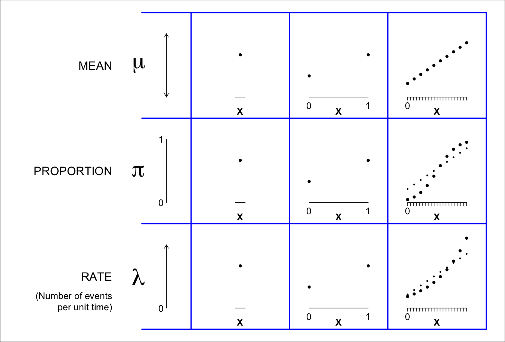

# (PART) Part I {-}

# Statistical Parameters {#paras} 

## Parameters

>**Parameter** – A constant (of unknown magnitude) in a (statistical) model. [OSM2011, p60]

**The parameters we will be concerned with** 

* $\mu$ The mean level of a quantitative characteristic, e.g. the depth of the earth's ocean or height of the land, or the height / BMI / blood pressure levels of a human population. [One could also think of mathematical and physical constants as parameters, even though their values are effectively 'known.' Examples where there is agreement to many many decimal places include the mathematical constant pi, the speed of light(c), and the gravitational constant G. The speed of sound depends on the medium it is travelling through, and the temperature of the medium. The freezing and boiling points of substances such as water and milk depend on altitude and barometric pressure]. At  a lower level, we might be interested in personal characters, such as the size of a person's vocabulary, or a person's mean (or minimum, or typical) reaction time. The  target could be a person's 'true score' on some test -- the  value one would get if one (could, but not realistically) be tested on each of the (very large) number of test items in the test bank, or observed/measured continously over the period of interest.  
\ \ \ \ Later on we will address sitautions where the mean $\mu$ is not the best 'centre' of a distribution, and why we might want to take some other feature, such as the median, or some other quantile, instead.  

* $\pi$ Prevalence or risk (proportion): e.g.,  proportion of the earth's surface that is covered by water, or of a human population that has untreated hypertension, or lacks internet access, or will develop a new health condition over the next x years. At a lower level, we might be interested in personal proportions, such as what proportion of the calories a person consumes come from fat, or the proportion of the year 2020 the person spent on the internet, or indoors, or asleep, or sedentary.

* $\lambda$ The speed with which events occur: e.g., earthquakes per earth-day, or heart attacks or traffic fatalities per (population)-year. At a lower level, we might be interested in personal intensities, such as the mean number of tweets/waking-hour  a person issued during the year 2020, or the mean number of times per 100 hours of use a person's laptop froze and needed to be re-booted.

Each of these three parameters refers to a characteristic of the overall domain, such as entire surface of the earth, or the entire ocean, or population. There are no indicators for distinguishing among subdomains, so they refer to locations / persons not otherwise specified. We will drill down  later.

Especially for epidemiologic research, and also more generally, one can think  of $\pi$ and $\lambda$ as  _parameters of occurrence_. [Although the word occurrence usually has a time element, it can also be timeless: how frequently a word occurs in a static text, or a mineral in a rock.] Prevalence is the proportion in a current state, and the 5-year risk is the expected proportion or probability of being in a new state 5 years from now. The  parameter $\lambda$ measures the speed with which the  elements in question move from the original to the other state.

Even though the depths of the ocean, and blood pressures, are measured on a _quantitative_ (rather than on all or none) scale, one can divide the scale into a finite number of bins/caterories, and speak of the prevalence (proportion) in each category. Conversely, one can use a set of descriptive parameters called quantiles, i.e, landmarks such that selected proportions, e.g., 0.05 or 5%, 25%, 50%, 75%, 95% of the distribution are to the left of ('below') these quantiles.


**Occurence Parameters are not constants of nature** [OSM1995]


>It has been noted in the philosophy of science that any science is concerned with functional relations of its objects (Friend and Feibleman, 1937). This proposition is quite evidently tenable for epidemiologic objects of research. Parameters of occurrence, such as the incidence rate for a particular illness, are not constants of nature. Rather, their magnitudes generally depend on — are functions of — a variety of characteristics of individuals — constitutional, behavioral, and/or environmental. Such relations, even if only remotely credible, are generally the objects of medical occurrence research. For example, one is quite usually interested in learning whether the rate of occurrence of some particular illness depends on (is related to or is a function of) gender — regardless of whether there is any express reason to surmise that it might be.

>EXAMPLE 1.5 The prevalence of any given blood type based on the ABO antigen system,, while constant over gender and essentially constant over age, is not a constant of nature. It varies by ethnic groupings, for example. Thus the prevalence must be quantified in relation to—as a function of—ethnic group.

>EXAMPLE 1.6. For the occurrence of various values of blood pressure among people, one descriptive parameter is the median of the pressure. (This is a value such that the prevalence of its exceedance is 50%.) This parameter, again, is not a constant of nature but depends on age and other characteristics  of individuals. For the quantitative nature of the age relation of systolic blood pressure, a rule of thumb used to be that it is, in mm Hg, 100 plus age in years." This rule expresses a regression model - a **regression function** - of the form P = A + B x Age. In this example, P, the occurrence parameter, is the median of systolic blood pressure, A = 100 mm Hg, and B = 1 mm Hg/yr.

>The characteristics on which the magnitude of an occurrence parameter depends (causally or otherwise) are **determinants** of the parameter. Thus, in the examples given above, ethnic grouping is a determinant of prevalence of any given blood type, and age is a determinant of the median of systolic blood pressure.

>"Determinant" has no implication as to causality in science — any more than in everyday locution: the current age of a person is "determined" by his/her year of birth (noncausally), just as the expected outcome of a disease is "determined" by the treatment that is used (causally). The relation of an occurrence measure to a determinant, or a set of determinants, is naturally termed an occurrence relation or an occurrence function. These relations are in general the objects of epidemiologic research. [Even though the general inconstancy of occurrence parameters leads to the consideration of occurrence relations, this latter outlook affords only a partial accommodation of the inconstancy, because occurrence relations the degree also vary according to the type of individual. In particular, measures of a relation (Appendix 2) have determinants of their own.]


**Before we start, a comment on terminology**

Before we go on, we need to adopt sensible terminology for referring generically to the states, traits, conditions or behaviours  whose category-specific parameter values are being compared. Following OSM (see above) we will use the term  `**determinant**'. It has several advantages over the many other terms used in different disciplines, such as exposure, agent,  independent/explanatory variable, experimental condition, treatment, intervention, factor, risk factor, predictor.

The main advantage is that it is broader, and closer to  causally neutral in its connotaion. _Exposure_ has environmental connotations, and technically refers to an opportity to injest or mentally take on board a substance or message.  _Agent_ has causal connotations. The term _independent variable_ suggests the investigator has control over it in a laboratory setting. The term _explanatory_ is  ambiguous as to the mechanism by which the parameter value in the index category got to be different from the value in the index category. Not all contrasts are experimentally formed. The term _factor_, and thus the term _risk factor_, are to be avoided because the word factor derives from the Latin _facere_, (the action of) doing, making, creating. _Predictor_ makes one think of the future. The term _regressor_ (or its shorthand, the 'X' ) won't be understood by lay people.

While the word 'determine' can suggest causality (e.g., demand determines the price), it also refers to 'fixing the form, position, or character of beforehand': two points determine a straight line; the area of a circle is determined by its radius.
There is considerable philosophical debate as to whether something 'causes' something else. Some would argue that the extent to which genetics determines one's personality is a causal concept. Others argue that since one cannot cannot consider the alternative, ones biological sex or age can not be considered a causal determinant or a risk factor (in the strict causal meaning of the word). They prefer to refer to them as risk _indicators_. 

We now move on to the parameter relations we will be concerned with, beginning with the simplest type.

## Parameters Contrasts

In applied research, we are seldom interested in a single constant. Much more often we are interested in the contrast (difference) between the parameter values in  different contexts/locations (Northern hemisphere vs Southern hemisphere), conditions/times (reaction times using the right versus left hand, or  behaviour on weekdays versus weekends), or sub-domains or sub-populations (females vs males).  Contrasts involving 'persons, places, and times' have a long history in epidemiology.

In this section, we will limit our attention to 'contrasts': a  compariosn of the parameter values between 2 contexts/locations/sub-populations. Thus (unlike in OSM's example 1.6) the parameter  function has just 2  possible 'input' values. The next section will address more general parameter functions. 


**'Reference' and 'Index' categories**

In many research contexts, the choice of 'reference' category (starting point, the category against which the other category is compared)  will be obvious: it is the status quo (standard care, prevailing condition or usual situation, dominant hand, better known category). The 'index' category is the  category one is curious about and wishes to learn more about, by contrasting its parameter value with the parameter value for the reference category.  
\ \ \ \ In other contexts, it is less obvious which category should serve as the reference and the index categories, and the choice may be merely a matter of persepctive. If one is more famiar with the Northern hemisphere, it serves as a natural starting point (or 'corner' to use the terminology of Clayton and Hills, or reference category). The choice of reference category in a longevity contrast between males and females, or in-hospital mortality rates or motor vehicle fatality rates during weekends versus weekdays, might depend on what mechanism one wishes to bring out. Or one might close as the reference category the one with the larger amount of experience, or maybe the one with the lower parameter value, so that the 'index minus reference' difference would be a positive quantity, or the 'index: reference ratio'  exceeds 1.


### Parameter relations in numbers and words

To make this concrete, we will use hypothetical (and very round) numbers and pretend we 'know' the true parameter values -- in our example
of the mean depth of the ocean in the Northern hemisphere (reference category) and Southern hemisphere (index category) -- to be 3,600 metres (3.6Km) and 4,400 metres (4.4Km) respectively. Thus, the difference (South minus North) is 800 metres or 0.8Km.

If we wished to show the two parameter values graphically, we might do so using the format in panel (a), which shows the 2 hemisphere-specific parameter values -- but forces the reader to calculate the difference.

Panel (b) follows a more reader-friendy format, where the difference (the quantity of interest) is isolated:  the original 2 parameters are converted to 2 new, more relevant ones. 

Panel (c) encodes the relation displayed in panel (b) in a single phrase that applies to both categories: Onto the 'starting value' of 3.8Km, one adds 0.8Km only if the  resulting parameter pertains to the Southern hemisphere. The 0.8Km is toggled off/on as one moves from North to South.    


```{r,eval=T, echo=F, fig.align="center", fig.height=7, fig.width=9, warning=FALSE, message=F}


plot3 = function(row){
     par(mfrow=c(1,3),mar = c(0,0,0,0.5) )
     TOP="Mean Ocean\ndepth (Km)"
     x=c(0.225,0.775)
     mu = c(3.6,4.4)
     
     LABEL=c("North", "South")
     delta.mu = mu[2]-mu[1]
     
     PARA = t(matrix( c( toString(mu[1]),
                            toString(mu[2]),
                  toString(mu[1]), 
                  paste( toString(mu[1]), " + ",
                         toString(delta.mu),sep=""),
        rep(paste(toString(mu[1]),
                  " + ",toString(delta.mu),
                  " if South",sep=""),2)
                  ),2,3) ) 
        
     SRT=35 
     
     dy= 1
     for(co in 1:3){
         plot(x,mu,yaxt="n",xlim=c(0,1),
              ylim=c(-0.2,ceiling(mu[2])))
         text(0, ceiling(mu[2]),
	          c("(a)","(b)","(c)")[co],
	          adj=c(0,0), cex=2)
       
	       if(co==1){
       arrows(x[1]-0.1,0,
              x[1]-0.1,ceiling(mu[2]),
              length=0.07,angle=30)
	     text(x[1]-0.15, mean(mu),
	          "Mean Depth of Oceans (Km)",
	          adj=c(1.25,0), srt=90, cex=2.0)
     }
	     for( y in seq(0,ceiling(mu[2]),dy)){
	     	segments(x[1], y, x[2],y, col="lightblue")
	     	text(x[1]-0.015, y,toString(y),
	     	     adj=c(1,0.5),cex=1.5)
	     	text(x[2]+0.015, y,toString(y), 
	     	     adj=c(0,0.5), cex=1.5)
	     	
	     } 
	     text(0.5,1.05*ceiling(mu[2]),TOP,adj=c(0.5,0),cex=1.2,font=2) 
	     points(x,mu,pch=19,cex=0.75)
	     for(j in 1:2){
	       txt = PARA[co,j]
	       if(row==2 & co == 1 & j==1) txt = 
	           expression(mu[N])
	       if(row==2 & co == 1 & j==2) txt = 
	           expression(mu[S])
	       
	       if(row==2 & co == 2 & j==1) txt = 
	           expression(mu[N])
	       if(row==2 & co == 2 & j==2) txt = 
	           expression(mu[S] + Delta * mu)
	       
	       if(row==2 & co == 3 ) txt = 
	          expression(mu[S] == paste(mu[0] + Delta * mu ,
	                                 " ",textstyle(x)," S"))
	       
	     	text(x[j]  - 0.00*(j==1) + 0.00*(j==2), 
	     	     mu[j] - 0.15,
	     	     txt, 
	                        adj=c(0.5, 0.5),
	                        cex=1.75,srt=SRT)
	     	  LAB = LABEL[j]
	     	  if(row==2 & co == 3 ) LAB=c("0","1")[j]
	        text(x[j],-0.15,LAB, adj=c(0.5,1),
	             cex=1.5)
	        if(row==2 & co == 3 & j==1 ) text( 
	              mean(x),-0.25,"S", adj=c(0.5,1),cex=1.5)
	     	
	     } 
	  }
}


plot3(1)

```

### Parameter relations in symbols, and with the help of an  index-category indicator

Panels (a) and (b) in the following Figure repeat the information in panels (a) and (b) in the preceding Figure, but using Greek letters to symbolically represent the parameters. Just to keep the graphics uncluttered, the labels North and South are abbreviated to N and S and used as subscripts. 

The relation encoded in a single phrase shown in the previous panel (c) has a compact form suitable for verbal communication. The representation can be adapted to be more suitable for computer calculations. (The benefit of doing this will become obvious as soon as you try to learn the parameter values by fiiting these models to actual data.) Depending on whether the hemisphere in question is the northern or southern hemisphere, the expression/statement 'the specified hemisphere is the SOUTHERN hemisphere' evaluates to a (logical) FALSE or TRUE. In the binary coding used in computers, it evaluates to 0 or 1, and we call such a 0/1 variable an 'indicator' variable.^ 


>^ In ‘better families’ we speak of INDICATOR variables, not DUMMY variables.  
The International Statistical Institute’s Dictionary of Statistical Terms objects to the name: the term is ‘used, rather laxly, to denote an artificial variable expressing qualitative characteristics …. [The] word ’dummy’ should be avoided.’  
Miettinen’s Epidemiological Research: Terms and Concepts:- Indicator variate – A variate with 0 and 1 as its (only) realizations, with realization 1 indicating something particular. (Examples: Y = 1 indicating membership in the case series of person-moments and X1 = 1 indicating index category of the etio-genetic determinant in an etiogenetic study – in the logistic model for the object of study.) Dummy variate (synonym: indicator variate) – See ‘Indicator variate’ in section II – 2. Note: This term is a misnomer: there is nothing dummy about an indicator variate.  
We encourage you  to use, in your coding,  **meaningful variable names** such as `i.South` or `i.Southern` (where stands for indicator of) or `i.Male`. Don't use the name `sex` or `gender`, where the coding is not self evident. If you think `i.Male` is over doing it, then use `Male`. 

In panel (c) in the following figure, just to keep the graphics uncluttered, the name of the indicator variable SOUTHERN is abbreviated to S.

```{r,eval=T, echo=F, fig.align="center", fig.height=7, fig.width=9, warning=FALSE, message=F}

plot3(2)

```

**What does the equation in panel (c) remind you of?**

Probably the equation of a line. In high school you may have learned it in the form $A + B \times X$ that Miettinen used to describe the relation between median blood pressure and age.

Today, in statistics, these equations are referred to as **regression equations**, and the statistical model is called a regression model. The term 'regression' is unfortunate, since it bears little relation to the original application. It concerned  the phenomenon of 'reversion' first described by Charles Darwin.  Following his first studies of the sizes of the 'daughter' seeds of sweet peas, his nephew Francis Galton, described the tendency:

> offspring did not tend to resemble their parent seeds in size, but to be always more mediocre ('middling', or closer to the mean) than they — to be smaller than the parents, if the parents were large; to be larger than the parents, if the parents were very small (Galton 1886)

One of the **_first 'regression' lines fitted to human data_** is Galton's  line depicting the 'rate of regression on hereditary stature' where, using the term 'deviate' where today we would use 'Z-scores.'

>The Deviates of the Children are to those of their Mid-Parents as 2 to 3. (Galton, 1886)

Because he used z scores (so the means in the parents and in the children were both 0) the equation of the line simplified to $$\mu(\textrm{Z-score in children of parents with mean z}) = 0 + (2/3) \times z$$

**But don't we need a _cloud of points_ to have a regression line?**

Although many courses and textbooks introduce regression concepts this way, the answer is **NO.** There is nothing in the regression formulation that specifies at which 'X' values the mean Y values at these X values are to be determined. Unlike many textbboks that start with Xs on a 'continuous' scale, and then later have to deal with a 2-point (binary) X, we are starting with this simplest case, and will move 'up' later.

We are doing this for a few reasons: in epidemiology, the first and simplest contrasts involve just two categories, the reference category and the index category; a simple subtraction of 2 parameter values is easier to do and to explain to a lay person; and there is no argument about how the function behaves at the values between 0 and 1. There are no parameter values at Male = 0.4 or Male = 1.4, they are only at Male=0 and Male=1.

In addition, it is easier to learn the fundamental concepts and principles of regression if we can easily 'see' what exactly is going on. Fewer blackbox formulae mean more transparency and understanding.

Once we see how to represent parameter values in two determinant-categories, we can easily extend it to more than two, such as the  ethnic groups in example 1.5 above.  
As we will see later on, when we have a value for a dental health parameter (eg the mean number of decayed, missing and filled DMF teeth) at X = 0 parts per million of fluoride in the drinking water, and another parameter value at X = 1 parts per million, we can only look at these 2 parameter values. If this is not enough, we would need to have (obtain) parameter values at the intermediate fluoride levels, or levels beyond 1 ppm, to trace out the full parameter relation, namely  how the mean-DMF varies as a function of fluoride levels. If we have large numbers of observations at each level, then the DMF means will trace out a smooth curve. If data are limited, and the trace is jumpy/wobbly, we will probably resort to a sensible smooth function, the coefficients of which will have to be estimated from (fitted to) data. 
 
This discussion leads on naturally to the next topic, where the parameter varies over quantitative levels of a determinant.  

## Parameter functions 

A very simple example of a function that describes how  parameter values vary over quantitative levels of a determinant is the straight line shown in the upper right panel of the next figure. Here the determinant has the generic name X, and the equation is of the $A + B \times X$ or $B_0 + B_1 \times X$ or $\beta_0 + \beta1 \times X$ straight line form. Miettinen used the convention that the upper case letters $A$ and $B$ are used to denote the (true but unknown) coefficient values, whereas the lower case leters $a$ and $b$ are used to denote their empirical counterparts, sometimes called estimated coefficients or fitted coefficients.  This sensible and simple convention also avoids the need, if one uses Greek letters for the theoretical coefficient values, to put 'hats' on them when we refer to their empirical counterparts, or 'estimate/fit' them. Fortunately, journals don't usually allow investigators to use 'beta-hats'; but this means that the investigators have to be more careful with their words and terms.


```{r,eval=T, echo=F, fig.align="center", fig.height=3, fig.width=4, warning=FALSE, message=F, out.width = "98%", fig.pos="h"}





```

**A few remarks on the panels in this Figure**

* The 3 rows refer to the 3 core parameters we have given examples of above. All 3  governed by the same principles, although there are more possibilities of scales with some parameters.

* In setting (column) 1: there is just 1 parameter (dot) corresponding to the 'overall' population or the entire domain. You can think of it as the limiting or 'degenerate' case of the columns to its right. One can still write it in a 'regression' model.
>It is of the form P(arameter) = $B$, involving no indicators for distinguishing among subdomains of the referent domain of the distribution, say adults not otherwise specified. [MSH2018, p63]
It is sometimes referred to as a null or 'incercept only' regression model.  
\ \ \ \ We will exploit this idea to take a more holistic/general and economical  approach to this introductory course. Many textbooks/courses do not mention regression models until quite late, and spend a lot of time on '1-sample' (and even '2-sample') problems without  pointing out that these are merely sub-cases of regression models. This 'silos' practice  of promoting/learning a separate software routine for dealing with a 1 sample problem, when one can get the same answer from a regression routine, leads to dead ends and wastes time.  
\ \ \ \ Once we get to fitting/estimating a mean (or proportion or rate) parameter to/from data, we will encourage doing so within a regression framework. 

* In setting (column) 2, there are 2 parameters, one for the reference category and one for the index category of the determinant. As we have seen, how they relate to each other can be can be expressed in a number of different ways. A common and useful way is via a parameter equation that contains a parameter for the reference category and a comparative parameter (some measure of the difference between the two parameters) -- the latter is often of most interest.

* In setting (column) 3, the parameter equation traces the parameter over a continuum, using as many coefficients as are needed.

**A few remarks on associated terminology**

Instead of **'regression models'**, some textbooks and courses refer to **'linear models'**. Miettenen explains a linear model this way:

>**Linear model**: Formulation of the mean/‘expectation’ of (the distribution of) a random variate (Y) as a linear compound of a set $B_0 , B_1  , B_2   , \dots$ of parameters: as $B_0 + B_1  X_1 + B_2  X_2 + \dots$  [OSM2011, p54]


>**The meaning of ‘linear’** in the appellation of this model has nothing to do with straight lines; it refers to the mathematical concept of ‘linear compound’: given quantities Q$_1$, Q$_2$, etc., a linear compound of these is the sum C$_1$Q$_1$ + C$_2$Q$_2$ + ..., where C$_1$ etc. are the ‘coefficients’ that define a particular linear compound of the set of quantities constituted by the Qs.
So, the ‘general linear model’ is linear in the sense that the dependent parameter, M, is formulated as a linear compound of the independent parameters B0, B1, etc., the coefficients in this linear compound being 1, X1, etc. The model is, in this way, ‘linear in the parameters.’ [MSH2018, p65]

Statistics courses in the social sciences, the biological laboratory sciences, and other experimentally-based sciences, typically move on from 1-sample and 1-sample procedures (unfortunately, mainly focusing on statistical _tests_) to **'analysis of variance' models**

Miettinen explains an **'analysis of variance models**  this way:

>In the 'analysis of variance model,' the random variate at issue – Gaussian – has a mean whose value depends on a _nominal-scale determinant_, a nominal scale being characterized by discrete categories without any natural order among them. The names of the (nominal) categories, some N in number, could be Category 1, Category 2, ... , Category N. The term for the model is a misnomer. For, at issue is not analysis but synthesis of data, and the synthesis is not directed to learning about the variance of the random variate; it focuses on the mean, the relation of the mean to the (nominal-scale) determinant of it.

>A simple example of these models might address the mean of systemic blood-pressure – defined as the weighted average of the diastolic and systolic pressures with weights 2/3 and 1/3, respectively – in relation to ethnicity, represented by three categories. An 'analysis-of- variance' model would define a random variate (Y) as representing the numerical value of the pressure (statistical variates inherently being numerical) and having a Gaussian distribution with means M1, M2, and M3 in those ethnicity categories 1, 2, and 3, respectively, with the variance of the distribution invariant among them. The random variate (Y) is the '_dependent_' variate in the meaning that the value of its mean depends on ethnicity; and the ethnicity categories are represented in terms of suitably-defined '_independent_' – non-random – variates (Xs).

>The form of the 'analysis-of-variance' model in this simple example is: $M = B_0 + B_1 X_1 + B_2 X_2$,
where $M$ is the mean of $Y$ and the two independent variates are indicators of two particular ones of the three ethnic categories. One possibility in this framework is to take $X_1$ and $X_2$ to be indicators of Category 2 and Category 3, respectively – an indicator variate being one that takes on the value 1 for the category it indicates, 0 otherwise.

>In terms of this model, $B_0$ is the value of $M$ when $X_1 = X_2 = 0$, that is, for Category 1 (i.e., $B_0 = M_1$); and for Category 2 and Category 3 the values of $M$ are represented by $B_0 + B_1$ and $B_0 + B_2$, respectively (i.e., $M_2 = B_0 + B_1$, and $M_3 = B_0 + B_2$). Thus, the difference between $M_1$ and $M_2$ is represented by $B_1$; $B_2$ represents the difference between $M_1$ and $M_3$; and the difference between $M_2$ and $M_3$ is the difference between $B_1$ and $B_2$.


>In this ‘analysis-of-variance’ framework it is feasible to accommodate, jointly, whatever number of nominal-scale determinants of the magnitude of the mean of the dependent variate. A simple example of this is the addition of the two categories of gender for consideration jointly with the three categories of ethnicity. These two determinants jointly imply a single nominal-scale determinant with six categories (as each of the three categories of ethnicity is split into two subcategories based on gender).

>When involved in the definition of the independent variates is only a single determinant, the model is said to be for 'one-way analysis of variance'; with two determinants the corresponding term (naturally) is 'two-way analysis of variance'; etc.


## A PHRASE TO AVOID 

It is quite common to hear a regression coefficient  (fitted or theoretical) interpreted this way:

>"For every 1 unit increase in X, the 'Y' parameter increases by $\beta_X$ units."

or as follows

>"As (when) you increase X by 1 unit, you increase the Y parameter by $\beta_X$ units." 

We pick up this terminology very early, maybe even back in high school, and from other people around us. 

But, in interpreting the B = 1 mm Hg/yr in Miettenen's example (100 plus age in years), should we use such phrases?

Or, since you don't know the source of, or the data behind this rule, maybe take a look at the distributions of some anthropometric chacteristics (height, forced expiratory volume, skinfold thicknesses, etc ) measured cross-sectionally, in  different populations in different calendar decades.  [link]
By eye, try to estimate the slope you would get if you regressed the age-and sex-specific means or medians 
on the ages. 

as X increasesa **


